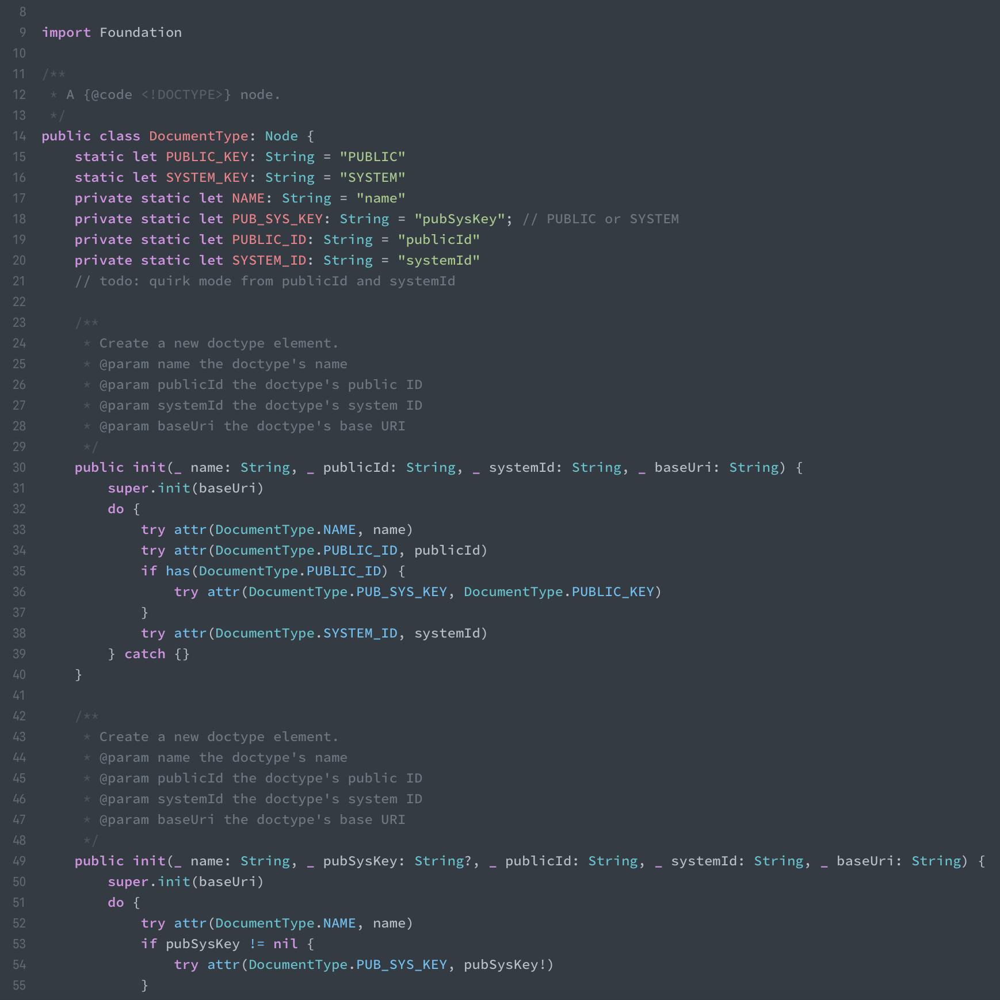

# Xcode One Theme

Atom One theme for Xcode

## How to use

1. Exit Xcode
2. Create `~/Library/Developer/Xcode/UserData/FontAndColorThemes` dir if not exits
3. copy `One (Light).xccolortheme` and  `One (Dark).xccolortheme` to `~/Library/Developer/Xcode/UserData/FontAndColorThemes`
